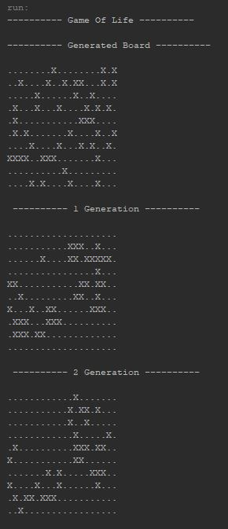

# Java basics
_Game Of Life_

This project is for Java learning and practicing only. 
During this project main aim to generate Game of life.

 
This is a small program, which generates random board of "X" and "."
Where "X" means neighbor and "." empty space.

The universe of the Game of Life is an infinite, two-dimensional orthogonal grid of square cells, each of which is in one of two possible states, live or dead, (or populated and unpopulated, respectively). Every cell interacts with its eight neighbours, which are the cells that are horizontally, vertically, or diagonally adjacent. At each step in time, the following transitions occur:

Any live cell with fewer than two live neighbours dies, as if by underpopulation.
Any live cell with two or three live neighbours lives on to the next generation.
Any live cell with more than three live neighbours dies, as if by overpopulation.
Any dead cell with exactly three live neighbours becomes a live cell, as if by reproduction.

These rules, which compare the behavior of the automaton to real life, can be condensed into the following:

Any live cell with two or three live neighbours survives.
Any dead cell with three live neighbours becomes a live cell.
All other live cells die in the next generation. Similarly, all other dead cells stay dead.

The initial pattern constitutes the seed of the system. The first generation is created by applying the above rules simultaneously to every cell in the seed; births and deaths occur simultaneously, and the discrete moment at which this happens is sometimes called a tick. Each generation is a pure function of the preceding one. The rules continue to be applied repeatedly to create further generations.

This program generates 50 generations only and if any following repeats previous one, game stops.

## Project goals

-   Generate random board
-   Implement nested loops
-   No repeating generations

## Authors

[Vadim](https://github.com/vadimmozeiko)
